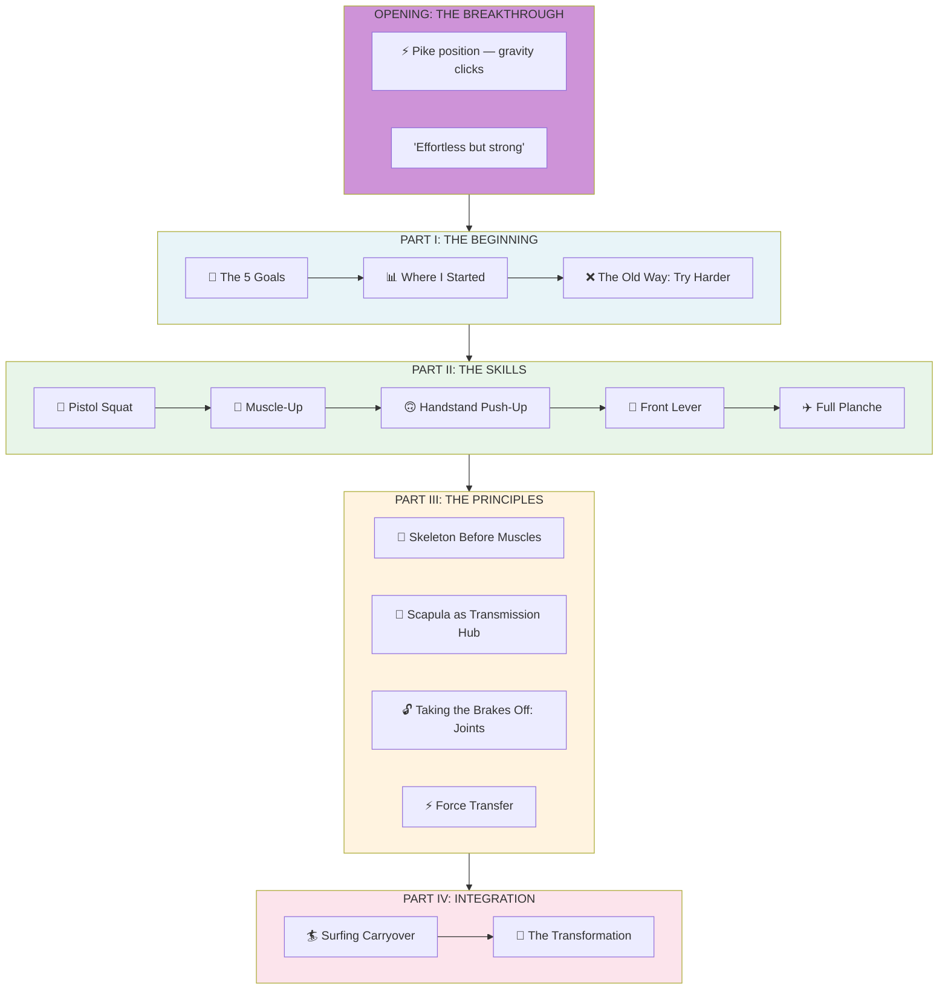
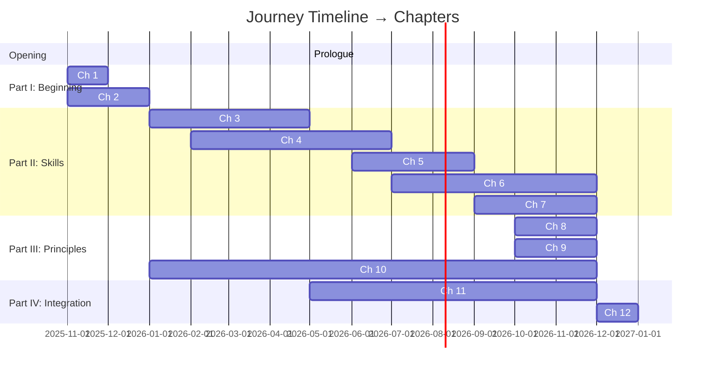
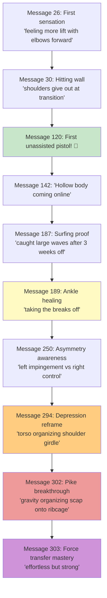
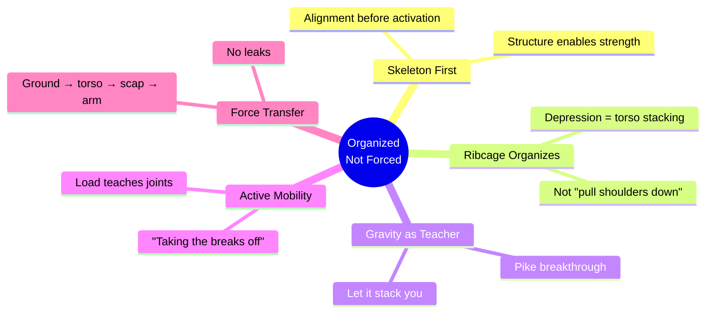

# Book Structure: Organized, Not Forced

## The Narrative Structure

**Each chapter follows the same arc:**


**Why this works:**
- Hook the reader with the sensation
- Create stakes by showing the struggle
- Deliver the insight with earned weight
- Prove it transfers beyond the gym

---

## The Journey Arc



---

## Chapter Map with Timeline



---

## Detailed Chapter Breakdown

### OPENING: THE HOOK

| Chapter | Opens With | Flashes Back To | Ends With |
|---------|------------|-----------------|-----------|
| **Prologue** | Pike position — gravity clicks. "Effortless but strong." The moment everything changed. | — | "How did I get here?" |

---

### PART I: THE BEGINNING

| Chapter | Opens With | Flashes Back To | Key Quote |
|---------|------------|-----------------|-----------|
| **1** | *The moment I wrote down 5 impossible goals* | Why skills, not aesthetics. 40 pushups, 5 pullups. The desire to understand. | "I want to be able to complete these calisthenics skills by the end of 2026" |
| **2** | *The old way: trying harder* | Years of "squeeze more, force it." Stretching that didn't fix anything. | "My body was so used to up-down" |

---

### PART II: THE SKILLS (Each follows Breakthrough → Flashback → Struggle → Shift → Carryover)

| Chapter | Opens With (Breakthrough) | The Struggle | The Shift | Carryover |
|---------|---------------------------|--------------|-----------|-----------|
| **3: Pistol Squat** | First unassisted rep on the left | Hinging at bottom, right side sticking point | "Taking the breaks off" — joints moving as intended | Ankle healing after years, surfing balance |
| **4: Muscle-Up** | Bar reaching chest, elbows moving back | "Shoulders give out at transition, can't control it" | Pull-press not up-down, hollow body connection | Understanding explosive force transfer |
| **5: Handstand Push-Up** | Overhead stacking click | Fighting gravity instead of using it | Scorpion insight — head up, push down | Surf popup mechanics |
| **6: Front Lever** | "Hollow body coming online" | Left/right disconnect, left side unstable | Depression as ribcage organization | Lat engagement pattern |
| **7: Planche** | Pike breakthrough — gravity organizing scap | "Depress harder" wasn't working | "Let gravity stack me into position" | Force transfer mastery |

---

### PART III: THE PRINCIPLES (Emerge from the skills)

| Chapter | The Principle | Where It Came From | How It Connects |
|---------|---------------|--------------------|-----------------| 
| **8** | *Skeleton Before Muscles* | Realizing alignment is organized, not forced | Thread through all 5 skills |
| **9** | *The Scapula Discovery* | Depression = ribcage organizing shoulder girdle | Planche + Front Lever + Muscle-Up |
| **10** | *Taking the Brakes Off: Joints as Entry Points* | Wrist/ankle warm-ups revealing activation patterns | Pistols fixed ankle popping that years of stretching/yoga/massage couldn't. Wrist prep unlocked handstand confidence. Joints aren't obstacles—they're the first place to organize. |

**Chapter 10 Key Moments:**
- "Taking the breaks off" — focusing on mechanics teaches using joints as intended
- Ankle popping that persisted for years started easing through pistol training, not stretching
- Warmups revealed left vs right: "I can completely tell a difference doing the warmups between the left where I feel the impingement vs the complete joint control on my right"
- Wrist prep became non-negotiable for Day 1 — "We don't push through wrists. We prepare them."
- Joint circles aren't just warm-up, they're diagnostic: where you feel restriction is where you're not organized

---

### PART IV: INTEGRATION

| Chapter | Opens With | Content | Closes With |
|---------|------------|---------|-------------|
| **11: Carryover** | Catching waves after 3 weeks off | Surfing, running, daily movement all changed | "I'm not training exercises — I'm training movement intelligence" |
| **12: Organized, Not Forced** | Return to the pike moment | The full transformation. Old cues → New cues. | "Strength is force expressed through organization" |

---

## The Transformation Arc

```mermaid
flowchart LR
    subgraph BEFORE["❌ BEFORE"]
        direction TB
        B1["Try harder"]
        B2["Squeeze more"]
        B3["Force the movement"]
        B4["Stretch, yoga, massage"]
        B5["Disconnected movements"]
    end

    subgraph SHIFT["⚡ THE SHIFT"]
        direction TB
        S1["Feel the sensation"]
        S2["Name the pattern"]
        S3["Let it organize"]
    end

    subgraph AFTER["✅ AFTER"]
        direction TB
        A1["Create conditions"]
        A2["Body organizes itself"]
        A3["Force transfers cleanly"]
        A4["Active mobility under load"]
        A5["Carryover to all movement"]
    end

    BEFORE --> SHIFT --> AFTER

    style BEFORE fill:#ffebee
    style SHIFT fill:#fff8e1
    style AFTER fill:#e8f5e9
```



---

## Breakthrough Progression



---

## Chapter → Message Mapping

| Chapter | Breakthrough (Opens With) | Struggle | Shift | Source Messages |
|---------|---------------------------|----------|-------|-----------------|
| Prologue | 302–303 (pike click) | — | — | 302, 303 |
| Ch 1 | 3 (goals) | — | — | 1–10 |
| Ch 2 | — | 30 (shoulders give out) | — | 26, 30, 45 |
| Ch 3 (Pistol) | 120 (first unassisted) | 142 (sticking point) | 189 (taking breaks off) | 120, 142, 187, 189 |
| Ch 4 (Muscle-Up) | 56 (rhythm emerging) | 30 (can't control transition) | 182 (pull-press click) | 26, 30, 56, 182 |
| Ch 5 (HSPU) | 225 (scorpion insight) | — | 227 (depression→protraction) | 225, 227 |
| Ch 6 (Front Lever) | 142 (hollow body online) | 250, 283 (left side) | 294 (ribcage organizing) | 142, 250, 283, 294 |
| Ch 7 (Planche) | 302 (gravity click) | — | 303 (effortless but strong) | 294, 302, 303 |
| Ch 8 (Principles) | 294 (depression reframe) | — | — | 294, 295 |
| Ch 9 (Principles) | — | — | — | Synthesized |
| Ch 10 (Carryover) | 187 (surfing proof) | — | — | 187, 225, 227 |
| Ch 11 (Close) | Return to 302 | — | — | 302, 303, 304 |

---

## The Core Insights (Thread Through All Chapters)



---

## Writing Order Recommendation

```mermaid
flowchart LR
    subgraph PHASE1["Phase 1: The Hook"]
        P["Prologue: Pike Breakthrough"]
    end
    
    subgraph PHASE2["Phase 2: Richest Material"]
        W3["Ch 3: Pistol Squat"]
        W7["Ch 7: Planche"]
    end
    
    subgraph PHASE3["Phase 3: The Struggle"]
        W4["Ch 4: Muscle-Up"]
        W2["Ch 2: The Old Way"]
    end
    
    subgraph PHASE4["Phase 4: Integration"]
        W10["Ch 10: Carryover"]
        W11["Ch 11: Transformation"]
    end
    
    subgraph PHASE5["Phase 5: Fill In"]
        W1["Ch 1: Goals"]
        W5["Ch 5: HSPU"]
        W6["Ch 6: Front Lever"]
        W8["Ch 8-9: Principles"]
    end

    PHASE1 --> PHASE2 --> PHASE3 --> PHASE4 --> PHASE5

    style PHASE1 fill:#ce93d8
    style PHASE2 fill:#c8e6c9
    style PHASE3 fill:#ffcdd2
    style PHASE4 fill:#fff9c4
    style PHASE5 fill:#e8f4f8
```



**Why this order:**
1. **Prologue first** — nail the breakthrough moment that hooks the reader
2. **Pistol + Planche** — your richest breakthrough material, write while it's vivid
3. **Muscle-Up + Old Way** — the struggle chapters, creates stakes
4. **Carryover + Transformation** — the payoff, why it all matters
5. **Fill in** — remaining chapters as you achieve skills through 2026

---

## Word Count Targets (Based on Publishing Research)

### Industry Standards
| Category | Word Count Range | Source |
|----------|------------------|--------|
| **Self-help books** | 30,000–70,000 words | Bestseller Publishing |
| **Per chapter (nonfiction)** | 2,000–4,000 words | Industry average |
| **Short self-help** | ~1,500 words/chapter | "Punchier" books |
| **Standard self-help** | ~4,000 words/chapter | Most bestsellers |

### Our Targets

| Chapter Type | Target | Section Breakdown |
|--------------|--------|-------------------|
| **Prologue** | 1,500–2,000 words | Hook + setup + "how did I get here?" |
| **Skill Chapters (3-7)** | 2,500–3,500 words | Full 5-beat arc with depth |
| **Principle Chapters (8-10)** | 2,000–3,000 words | Concept + multiple examples |
| **Integration Chapters (11-12)** | 2,500–3,500 words | Multiple domains + synthesis |

### Section Word Targets (Within Each Chapter)

| Section | Target | What It Needs |
|---------|--------|---------------|
| ⚡ Breakthrough | 300–500 words | Immediate sensation, hook |
| ⏪ Flashback | 400–600 words | Stakes, where you started |
| 🔥 **Struggle** | **600–1,000 words** | Multiple sessions, failed attempts, the grind |
| 💡 Shift | 400–600 words | The click, bolded principle |
| 🌊 Carryover | 300–500 words | Concrete proof with specifics |

> **Key insight**: The STRUGGLE section needs the most depth. Readers need to feel the wall before the breakthrough lands. Include multiple training sessions, specific failed attempts, sensations of things not working.

### Total Book Projection

| Scenario | Per Chapter | 12 Chapters | Assessment |
|----------|-------------|-------------|------------|
| **Current** | ~800 words | ~9,600 | ❌ Too short for publishing |
| **Minimum** | 2,000 words | 24,000 | ⚠️ On the short side |
| **Target** | 3,000 words | 36,000 | ✅ Solid self-help length |
| **Stretch** | 3,500 words | 42,000 | ✅ Strong positioning |

---

## What Makes This Book Different (Your Unique Contributions)

### The Landscape: What Already Exists

| Category | Books/Experts | What They Cover |
|----------|---------------|-----------------|
| **Technical Manuals** | Overcoming Gravity, Convict Conditioning | Progressions, programming, "what to do" |
| **Position/Mobility** | Becoming a Supple Leopard (Starrett) | Joint position, mobility protocols, bracing |
| **Movement Philosophy** | Ido Portal (no book), MovNat | Movement as practice, variability, integration |
| **Transformation Memoirs** | Can't Hurt Me, Finding Ultra | Inspiring stories, mental toughness |

### The 5 Gaps Only Your Book Fills

```
┌────────────────────────────────────────────────────────────────────┐
│  1. "ALIGNMENT IS ORGANIZED, NOT FORCED"                           │
│     ─────────────────────────────────────                          │
│     Starrett talks about position.                                 │
│     Ido talks about movement variability.                          │
│     YOU talk about organization under load as a nervous system     │
│     event, not a muscular instruction.                             │
│                                                                    │
│     The insight: You can't use muscles to pull skeleton into       │
│     place. Create conditions where skeleton organizes, muscles     │
│     support what emerges.                                          │
└────────────────────────────────────────────────────────────────────┘

┌────────────────────────────────────────────────────────────────────┐
│  2. "TAKING THE BRAKES OFF" — ACTIVE MOBILITY UNDER LOAD           │
│     ──────────────────────────────────────────────────────         │
│     PT world is catching on: "You only keep new ranges when you    │
│     can control the joint under load."                             │
│                                                                    │
│     But NO calisthenics book has this as a core principle.         │
│     You lived it: Years of stretching/yoga/massage failed.         │
│     Pistol squats fixed your ankle popping. Skill work IS the      │
│     mobility work.                                                 │
└────────────────────────────────────────────────────────────────────┘

┌────────────────────────────────────────────────────────────────────┐
│  3. REAL-TIME MEMOIR + TECHNICAL INSTRUCTION (SIMULTANEOUSLY)      │
│     ────────────────────────────────────────────────────────       │
│     Most books are EITHER:                                         │
│     • Transformation memoirs (inspiring but don't teach)           │
│     • Technical manuals (teach but aren't personal)                │
│                                                                    │
│     You're BOTH. Documenting sensations AS you discover the        │
│     principles. Reader experiences "aha" moments WITH you.         │
└────────────────────────────────────────────────────────────────────┘

┌────────────────────────────────────────────────────────────────────┐
│  4. FORCE TRANSFER AS FELT EXPERIENCE                              │
│     ─────────────────────────────────────                          │
│     "Ground → torso → scap → arm → force" exists in biomechanics.  │
│                                                                    │
│     Nobody has written it as SENSATION in first-person:            │
│     • "No energy lost in my lats and traps"                        │
│     • "Effortless but strong"                                      │
│     • "Depression holds and I can press like no other day"         │
└────────────────────────────────────────────────────────────────────┘

┌────────────────────────────────────────────────────────────────────┐
│  5. CROSS-DOMAIN CARRYOVER (CALISTHENICS → SURFING → LIFE)         │
│     ──────────────────────────────────────────────────────         │
│     No calisthenics book documents real carryover to another       │
│     sport in real-time:                                            │
│     • Pike pushup breakthrough → surfing popup clicks              │
│     • Pistol training → board balance improves                     │
│     • Hollow body connection → paddle power after weeks off        │
│                                                                    │
│     This proves the insights aren't gym tricks—they're             │
│     MOVEMENT INTELLIGENCE that transfers everywhere.               │
└────────────────────────────────────────────────────────────────────┘
```

### Your Book vs. The Competition

| What Existing Books Do | What Your Book Does |
|------------------------|---------------------|
| Instruction manuals — "Here's how to do a planche" | Real-time discovery — documenting the exact moment it clicked |
| Position-focused — "Get into correct position" | Organization-focused — "Create conditions where body organizes itself" |
| Mobility drills separate from skills | Skill work AS active mobility — "Pistols fixed my ankles, not stretching" |
| Muscular cues — "Depress your shoulders" | Nervous system cues — "Let gravity stack me into position" |
| One domain — gym performance | Cross-domain carryover — surfing pop-ups clicked because of pike pushups |
| Expert teaching down | Practitioner discovering up — documenting the journey as it happens |
| After-the-fact memoir | Mid-journey documentation — sharing breakthroughs as they occur |

### The One-Line Differentiator

> "Most movement books tell you what to do. This book shows what it FEELS like when the body finally connects—and proves it transfers beyond the gym."

---

*"Feel it → Name it → Let it organize"*
