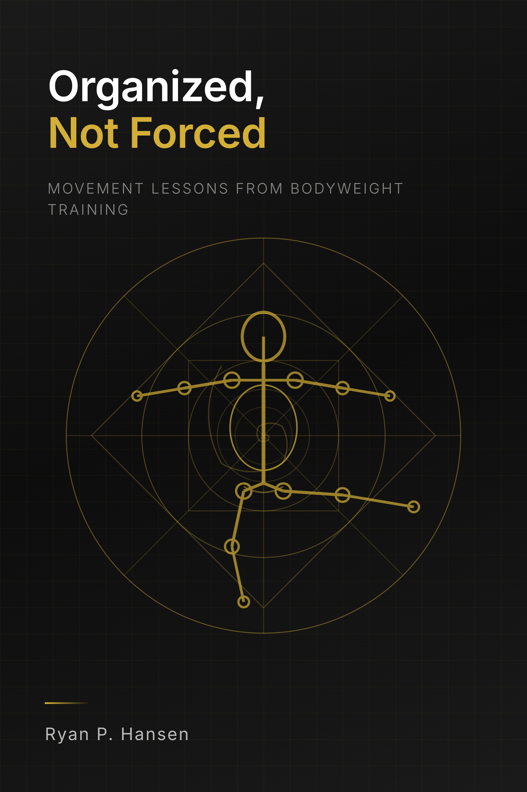

# Organized, Not Forced

**Movement Lessons from Bodyweight Training**

*By Ryan P. Hansen*

---

---

## About This Book

Real strength comes from allowing your skeleton to organize itself under load—not from grinding harder. This book teaches you how to move better and understand your body through calisthenics and yoga, revealing the paradox that releasing tension unlocks true power and mobility.

**"Organized, not forced."**

---

## Table of Contents

| Chapter | Title |
|---------|-------|
| [Prologue](chapters/00-prologue.md) | Introduction |
| [Chapter 1](chapters/01-five-goals.md) | Five Goals |
| [Chapter 2](chapters/02-old-way.md) | The Old Way |
| [Chapter 3](chapters/03-pistol-squat.md) | The Pistol Squat |
| [Chapter 4](chapters/04-muscle-up.md) | The Muscle-Up |
| [Chapter 5](chapters/05-hspu.md) | Handstand Push-Up |
| [Chapter 6](chapters/06-front-lever.md) | Front Lever |
| [Chapter 7](chapters/07-planche.md) | The Planche |
| [Chapter 8](chapters/08-skeleton.md) | The Skeleton |
| [Chapter 9](chapters/09-scapula.md) | The Scapula |
| [Chapter 10](chapters/10-joints.md) | Joints |
| [Chapter 11](chapters/11-carryover.md) | Carryover |
| [Chapter 12](chapters/12-organized-not-forced.md) | Organized, Not Forced |

---

## Core Principle

> "You can't use muscles to pull your skeleton into place. You create conditions where the skeleton can organize itself under load."

---

## License

© 2026 Ryan P. Hansen. All rights reserved.
